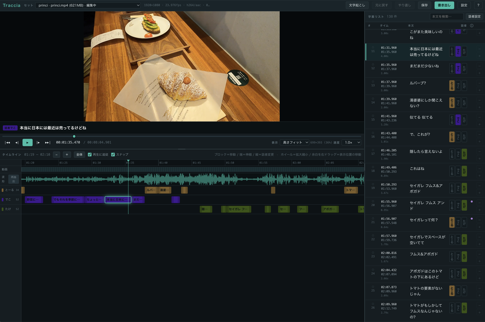
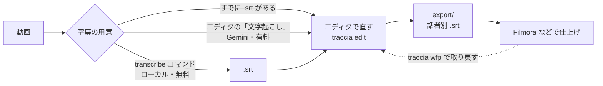

# Traccia — 話者別の字幕エディタ

**話者ごとに分かれた字幕を、人が直すためのエディタ。** ブラウザで動く。



上がプレビューと再生位置、下が波形と**話者ごとのレーン**、右が字幕リスト。
ブロックを掴んで尺を直し、上下に動かして話者を変え、リストで本文を打ち直す。

自動の文字起こしは、精度がどれだけ上がっても**最後は人が直すことになる**。
Traccia はその直す作業のための道具で、文字起こしは素材をそこへ運ぶための入口として付いている。

名前はイタリア語の *traccia*（なぞった跡 / 音声トラック）から。
音声を文字と時間でなぞってタイムラインに並べる、という中身をそのまま指している。

---

## できること

**直す**

- 話者ごとのレーンに並べたタイムラインで、尺と話者を**ドラッグで直す**
- 波形とプレビューを見ながら、リストで本文を打ち直す（`Tab` で次の行へ流せる）
- `S` で分割、`M` で結合、`I` / `O` で開始・終了を再生位置に合わせる
- **同じ話者の中での重なり**と、読み切れない表示速度に注意マークを出す
- 行頭の番号をクリックして**目印**を付け、あとでそこだけ絞り込む
- `⌘Z` / `⇧⌘Z`、4 秒ごとの自動保存、5 世代のバックアップ

**出す**

- 話者ごとに `.srt` を書き出す
- **元の `.srt` は読むだけで、一切書き換えない**
- Filmora で仕上げた最終版を、**エディタのボタンから**取り戻せる（`.wfp` の取り込み）

**戻す**

- 文字起こしの生出力・手作業の確定版・wfp の最終版を、**別々に残す**
- wfp を取り込むとき、**手作業で直し切った版は自動で退避される**（上書きされない）

**比べる**

- 残っている版を**左右に並べて差を見る**。何がどう変わったかを種類ごとに分類する
- 「文字起こしの誤り」と「演出上の書き直し」を分けて数える
- 行をクリックすると、その位置の音が鳴る

**学ぶ**

- 人が直し終えた字幕から、**この現場の字幕の作り方**（1 行の長さなど）を測る
- 測った値を次の文字起こしに渡す。**承認したものだけ**が反映され、いつでも戻せる

**測る**

- 1 本にどれだけ時間がかかったかを記録して、次の見積もりに使う

→ [エディタの使い方](docs/editor.md) ／ [直したものを次に活かす](docs/feedback.md)

---

## 字幕をどう用意するか

エディタは `.srt` があれば動く。用意の仕方は 3 通りある。



| 入口 | どこで | 費用 | 使いどころ |
|---|---|---|---|
| **すでにある `.srt` を置く** | — | 無料 | 他のツールで文字起こし済み |
| **エディタの「文字起こし」** | エディタの画面から | **有料**（1 時間の動画あたり $2 前後）| 手軽に済ませたい。Windows を経由しない |
| **`transcribe` コマンド** | GPU のある Windows / Apple Silicon | 無料 | 費用をかけたくない。本数が多い |

**エディタの「文字起こし」** は、動画だけ入れたセットでもそのまま実行できる。Gemini の API を
使うので有料だが、実行前に必ず想定費用が出て、今月の上限も張れる。既定は「使わない」。
→ [文字起こし（Gemini・有料）](docs/gemini.md)

**無料で済ませたいとき**は、先にコマンドで `.srt` を作ってからエディタで開く。
できた `dest/<名前>/` フォルダに動画を入れて `resources/` へ置けば、そのまま 1 セットになる。
→ [文字起こし（ローカル・無料）](docs/transcribe.md)

```bash
.venv/bin/python -m traccia transcribe 動画.mp4 --diarize --speakers 4 --split-speakers
```

### なぜ手元の Mac で文字起こししないのか

Intel Mac（x86_64）には Apple Silicon の Neural Engine も CUDA も無く、Intel Mac 向け
PyTorch は 2.2.2 で打ち切られている。**Apple Silicon なら CPU でも実用的な速度で回る**ので
Mac 単体で完結できる。処理時間の実測は
[文字起こしマニュアル](docs/transcribe.md#処理時間の目安)を参照。

Windows を GPU 機として使う場合、いまは `dest/<名前>/` を手でコピーしている。
いずれ Mac のエディタから呼べるようにする予定（[次にやること](docs/internals.md#次にやること)）。

---

## 始める

**編集するだけなら、API キーは 1 つも要らない。** 編集側は標準ライブラリと PyAV だけで動く。

```bash
git clone git@github.com:uribow-lab/traccia.git
cd traccia
python3.12 -m venv .venv
.venv/bin/python -m pip install -r requirements.txt
```

素材を置いて、

```
resources/
  princi/
    princi.mp4      動画
    princi.srt      「話者A: 本文」形式の字幕（無くてもよい）
```

起動する。ブラウザが開く。

```bash
.venv/bin/python -m traccia edit
```

Mac は `Traccia.command`、Windows は `Traccia.bat` のダブルクリックでも同じ。

| サブコマンド | 何をするか |
|---|---|
| **`edit`** | **字幕を直す。3 ペインのエディタ（これが本体）** |
| `transcribe` | 文字起こし + 話者分離（faster-whisper / pyannote） |
| `wfp` | Filmora のプロジェクト（`.wfp`）から、仕上げた字幕を取り戻す |

`transcribe` の重い依存（torch / pyannote / faster-whisper）は、そのサブコマンドを
実行したときにだけ読み込む。**エディタの起動は 0.1 秒ほど**で、
`requirements.txt` を入れていなくても立ち上がる。

> **素材は付いてきません。** `resources/` は `.gitignore` で除外してあり、clone しても
> 存在しません。ドキュメントに出てくる `sample` / `princi` / `bluebottle` は、
> 手元の素材に付けた名前の例です。

環境別の手順は [セットアップと起動](docs/setup.md) にある。

---

## ドキュメント

| | |
|---|---|
| [エディタの使い方](docs/editor.md) | 画面・マウス・キーボード・字幕の追加と分割・注意マーク・話者の設定 |
| [素材と保存先](docs/workflow.md) | 素材の置き方、Traccia が何をどこに書くか、世代バックアップ、作業時間の記録 |
| [セットアップと起動](docs/setup.md) | 環境別の入れ方、起動の仕方、コマンドの書き方 |
| [文字起こし（Gemini・有料）](docs/gemini.md) | エディタのボタンから書き起こす。費用と、使いすぎないための仕掛け |
| [文字起こし（ローカル・無料）](docs/transcribe.md) | `transcribe` の詳細。環境別セットアップ、全オプション、処理時間、トラブルシューティング |
| [Filmora から字幕を取り出す](docs/filmora.md) | `wfp` の詳細。エディタからの取り込み、話者の見分け方、字幕トラックの判定 |
| [直したものを次に活かす](docs/feedback.md) | 版の残し方、差分の見方、作法の学習。何が効いて何が効かなかったか |
| [API キーの取得手順](docs/api-keys.md) | `GEMINI_API_KEY` / `HF_TOKEN` ほかの取り方と、詰まりやすいところ |
| [中身の話](docs/internals.md) | ファイル構成、処理の流れ、なぜそうしたか、これから何をするか |
| [SECURITY.md](SECURITY.md) | キーと素材の扱い、脆弱性の報告先 |
| [CONTRIBUTING.md](CONTRIBUTING.md) | 何を歓迎して、何を受けていないか |

---

## リポジトリに含まれないもの

clone しても以下は付いてきません。**どれも Traccia の動作には不要**です。

| | 何か | なぜ含めないか |
|---|---|---|
| `resources/` | 素材の動画と字幕 | 動画 1 本で 600〜900MB あり、中身も手元のもの。→ [素材の置き方](docs/workflow.md#素材の置き方) |
| `bench/` | 文字起こし API を比較した検証用スクリプト | 実行結果に素材の書き起こしがそのまま残るため。`docs/api-keys.md` に出てくる数字はここで実測したもの |
| `docs-local/` | 手元用のメモ・下書き | 公開するものではない |
| `.env` | Jira / Chatwork 連携の値 | 開発ワークフロー用。キー名の見本は `.env.example` にある |
| `.venv/` | 仮想環境 | `requirements.txt` から作り直せる |

---

## ライセンス

MIT License（[LICENSE](LICENSE)）。

依存パッケージのライセンスは、このリポジトリのライセンスとは別です。
とくに **PyAV は FFmpeg のバイナリを同梱しており、LGPL が絡みます**。
ソースの形で配布・利用するぶんには影響はほぼありませんが、
将来これを 1 つの実行ファイル（`.app` など）にまとめて配る場合は、
そこで改めて確認が要ります。

そのほかの主な依存は MIT / BSD-3 / Apache-2.0 です。
