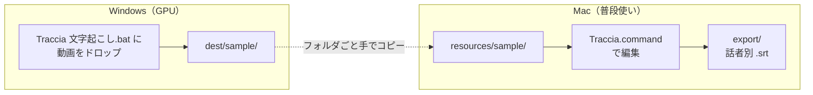
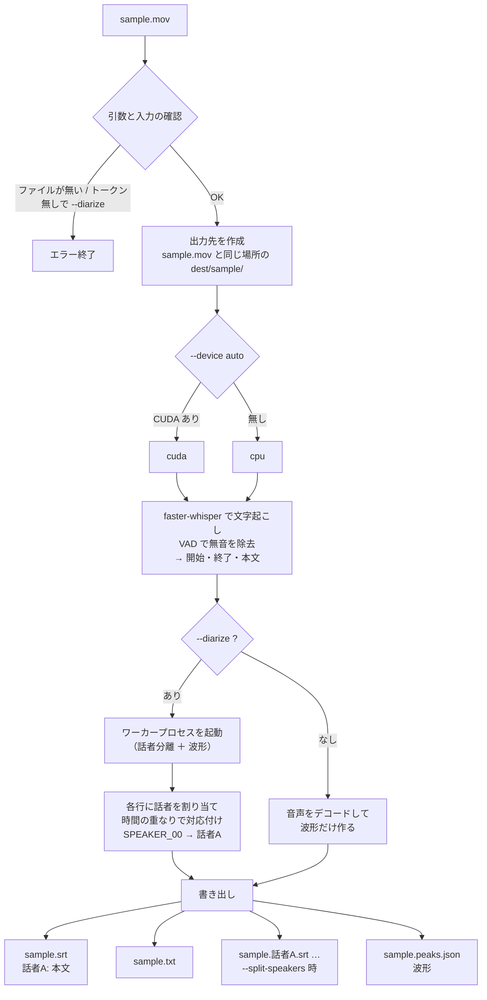
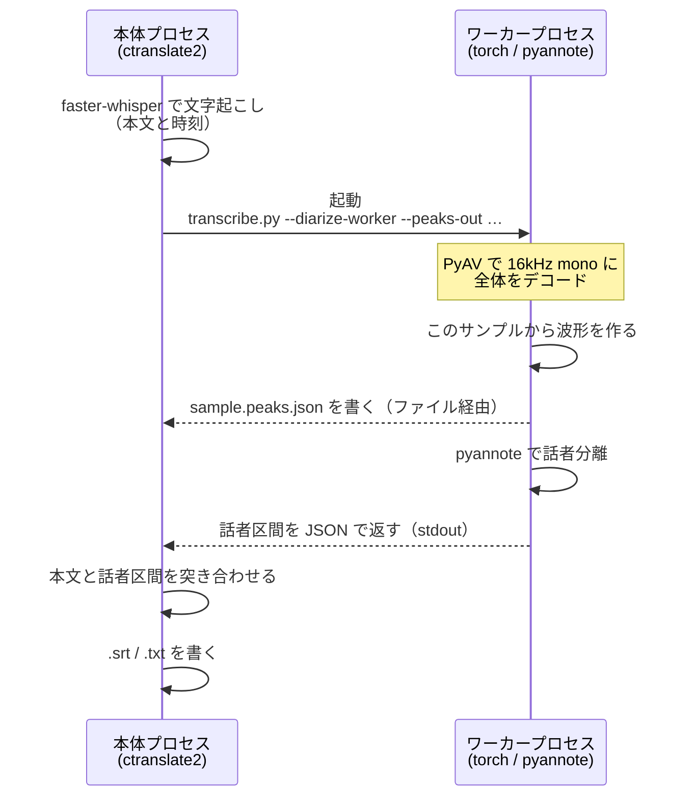

# Traccia — 話者別字幕ツール

動画から文字起こしして話者を分け、その結果を人が直すためのツール。

名前はイタリア語の *traccia*（なぞった跡 / 音声トラック）から。
音声を文字と時間でなぞってタイムラインに並べる、という中身をそのまま指している。

| サブコマンド | 何をするか | どこで走らせるか |
|---|---|---|
| `transcribe` | 文字起こし + 話者分離（faster-whisper / pyannote）| **GPU のある Windows**。Intel Mac では実用にならない |
| `edit` | 出てきた `.srt` を人が直す（3 ペインのエディタ）| **Mac**。ブラウザで動く |

編集側は標準ライブラリだけで動く（動画のメタデータ取得に、すでに入っている PyAV を使う）。
`transcribe` の重い依存（torch / pyannote / faster-whisper）は、そのサブコマンドを
実行したときにだけ読み込むので、エディタの起動は 0.1 秒ほど。

---

## 目次

1. [全体の流れ](#全体の流れ)
2. [セットアップ](#セットアップ)
3. [起動](#起動)
4. [素材の置き方](#素材の置き方)
5. [保存先](#保存先)
6. [画面](#画面)
7. [操作](#操作)
8. [話者の名前と色](#話者の名前と色)
9. [プレビューの表示](#プレビューの表示)
10. [設定の自動保存](#設定の自動保存)
11. [作業時間の計測](#作業時間の計測)
12. [エディタから文字起こしする（Gemini・有料）](#エディタから文字起こしするgemini有料)
13. [文字起こし（ローカル・無料）](#文字起こしローカル無料)
14. [Filmora から字幕を取り出す](#filmora-から字幕を取り出す)
15. [ファイル構成](#ファイル構成)
16. [次にやること](#次にやること)
17. [ライセンス](#ライセンス)

---

## 全体の流れ



1. **Windows** — 動画を `Traccia 文字起こし.bat` にドラッグ＆ドロップして、GPU で文字起こし
2. できた `dest/<名前>/` フォルダを、Mac の `resources/` に置く（動画も同じフォルダへ）
3. **Mac** — `Traccia.command` をダブルクリックして直す
4. 「書き出し」で話者ごとの `.srt` を出す
5. Filmora で動画と `.srt` を並べて仕上げる。そこで直した最終版は
   `python -m traccia wfp` でプロジェクト（`.wfp`）から取り戻せる
   （[Filmora から字幕を取り出す](#filmora-から字幕を取り出す)）

2 の手動コピーは、いずれ Windows 側をワーカーにして Mac から呼べるようにする予定
（[次にやること](#次にやること)）。

**Windows を経由したくないとき**は、動画だけを `resources/<名前>/` に置いて、エディタの
「文字起こし」で Gemini に書き起こさせる道もある。ただし**有料**（1 時間の動画あたり $2 前後）。
無料で済ませたいなら上の流れのまま、先にローカルで文字起こしする。
→ [エディタから文字起こしする（Gemini・有料）](#エディタから文字起こしするgemini有料)

### なぜ Mac で文字起こししないのか

Intel Mac（x86_64）には Apple Silicon の Neural Engine も CUDA も無く、Intel Mac 向け
PyTorch は 2.2.2 で打ち切られている。Apple Silicon なら CPU でも実用的な速度で回るので
Mac 単体で完結できる。処理時間の実測は `manual.md` の「処理時間の目安」を参照。

---

## セットアップ

### Mac（編集用）

```bash
cd /path/to/traccia
python3.12 -m venv .venv
.venv/bin/python -m pip install -r requirements.txt
```

編集だけなら PyAV しか要らないが、`requirements.txt` 一式を入れておけば
Mac 単体でも（遅いが）文字起こしできる。

### Windows（文字起こし用）

CUDA 版 PyTorch の入れ方を含め、`manual.md` の
「Windows（CUDA / GPU）でのセットアップ」に手順がある。

HuggingFace のトークンは環境変数で持たせる。一度だけ実行しておく。

```
setx HF_TOKEN hf_xxxxxxxx
```

**トークンの取り方は [`docs/api-keys.md`](docs/api-keys.md) にまとめてある。**
pyannote は利用条件への同意が必要な gated モデルなので、トークンを作るだけでは足りない。

> **トークンをファイルに書かないこと。**
> `mac_command.txt` / `win_実行コマンド.txt` には平文で入っているので `.gitignore` で
> 除外してある。もし過去にどこかへ push しているなら、そのトークンは漏れている前提で
> 失効させて発行し直すこと。

---

## 起動

### ダブルクリック

| | ファイル |
|---|---|
| Mac・エディタ | `Traccia.command` |
| Windows・エディタ | `Traccia.bat` |
| Windows・文字起こし | `Traccia 文字起こし.bat`（動画をドラッグ＆ドロップ）|

`Traccia.command` は Dock に置いておける。終了はそのウィンドウで `Ctrl+C`。

### コマンド

```bash
cd /path/to/traccia

.venv/bin/python -m traccia edit                     # エディタ（既定: ./resources）
.venv/bin/python -m traccia edit ~/別の素材 --port 9000
.venv/bin/python -m traccia edit --no-browser

.venv/bin/python -m traccia transcribe 動画.mp4 --diarize --speakers 4 --split-speakers
```

Windows は `.venv\Scripts\python -m traccia ...`。

`python` というコマンドは macOS には無い。**必ず `.venv/bin/python`** を使う。
毎回打つのが面倒なら `~/.bash_profile` に置く。

```bash
alias traccia='/path/to/traccia/.venv/bin/python -m traccia'
```

> エディタの既定ポートは 8791。macOS では 8770 番を `sharingd` が握っていることがあるため
> 避けている。使用中のときは自動で別のポートを選び、その旨を起動時に表示する。

これまでの `python transcribe.py 動画.mp4 --diarize ...` もそのまま動く
（`transcribe.py` は `traccia/transcribe.py` へ転送するだけの薄いファイル）。
`mac_command.txt` / `win_実行コマンド.txt` は書き換え不要。

---

## 素材の置き方

> **素材は付いてきません。各自で用意してください。**
> `resources/` は `.gitignore` で除外してあり、clone してもフォルダごと存在しません。
> 初回は自分で `resources/` を作り、その下にセットを置いてください。
> この README や `manual.md` に出てくる `sample` / `princi` / `bluebottle` は、
> 手元の素材に付けた名前の例です。同じ名前のファイルを探しても見つかりません。

`resources/` の直下に、1 セット = 1 フォルダで置く。

```
resources/
  princi/
    princi.mp4           ← 動画（最初に見つかった mp4/mov/mkv/m4v/webm）
    princi.srt           ← 本体（「話者A: 本文」形式）これを読む
    princi.話者A.srt      ← 話者別。本体が無いときだけマージして読む
    princi.話者B.srt
```

フォルダ名は何でも構いません（エディタのセット名になります）。
`.srt` がまだ無い状態でも、動画だけ置けばエディタから文字起こしできます
（[Gemini・有料](#エディタから文字起こしするgemini有料) / [ローカル・無料](#文字起こしローカル無料)）。

### 読み込み時の扱い

抽出器が隙間埋めに入れる**本文が空のブロックは落とす**（princi は 111→109、
bluebottle は 269→267）。落とした件数は起動時のメッセージに出る。
通し番号は書き出し時に 1 から振り直す。

---

## 保存先

**元の `.srt` は読むだけで、一切書き換えない。**

| 内容 | 場所 |
|---|---|
| 編集中のデータ | `<セット>/<名前>.edit.json` |
| 話者の名前と色 | `<セット>/<名前>.settings.json` |
| PCM 波形のピーク | `<セット>/<名前>.peaks.json` |
| 編集にかけた時間 | `<セット>/<名前>.worklog.json` |
| 世代バックアップ | `<セット>/backup/<名前>.edit.json.1` 〜 `.5` |
| 書き出した .srt | `<セット>/export/<名前>.話者X.srt` |
| 全体版（話者プレフィクス付き）| `<セット>/export/<名前>.srt` |

`.edit.json` があれば次回はそちらを読む。原本の状態に戻したいときは `.edit.json` を消す。

### 書き出しの形式

話者別 `.srt` は、**先頭に本文なしのブロック**（`00:00:00,000` からその話者の最初の発話まで）を
入れて出す。これが無いと、読み込む側が 1 本目の字幕の開始を 0 秒と解釈して全体がずれる。
`transcribe.py` の話者別出力と同じ形式。

```
1
00:00:00,000 --> 00:01:02,540


2
00:01:02,540 --> 00:01:08,020
フラーゴラとルバーブ
```

全体版（話者プレフィクス付き）には入れない。

編集は 4 秒後に自動保存される。`⌘S` で即保存。
書き出し時、字幕が 1 件も無い話者は空ファイルを作らずスキップする。

### 世代バックアップ

`.edit.json` と `.settings.json` は、上書きする前に直前の内容を
セットフォルダの `backup/` へ退避する。

```
princi/
  princi.edit.json          いま
  backup/
    princi.edit.json.1      1つ前
    princi.edit.json.2      2つ前
      …                     .5 まで（古いものから捨てる）
    princi.settings.json.1
      …
```

間違えて消した・意図しない上書きをしたときは、番号付きのファイルを
元の場所・名前に戻せば復帰する。

```bash
cp backup/princi.edit.json.1 princi.edit.json
```

**大事な作業のあとは、セットフォルダごと別の場所へコピーしておくこと。**
世代バックアップは同じフォルダにあるので、フォルダごと失う事故は防げない。

---

## 画面

```
┌──────────────────────────┬──────────────┐
│ プレビュー / 現在の字幕 / 操作 │ 字幕リスト     │
├──────────────────────────┤ （本文と話者を  │
│ タイムライン                │  直す用）      │
│  動画 / 波形 / 話者レーン      │              │
└──────────────────────────┴──────────────┘
```

ペインの境界はドラッグで動かせる。プレビューの高さを変えると動画もそれに追従する。

現在の再生位置にかかっている字幕は、タイムラインのブロックとリストの行の**両方**が光る。

読み込み直後は、字幕の長さの中央値からブロックが掴める幅になる範囲を自動で選んで開く
（30〜300 秒。bluebottle は 60 秒、princi は 90 秒）。全体を見るときは「全体」ボタンか `0` キー。

> **全体表示のときは表示位置を動かせない。** 表示範囲＝動画全体なので動かす余地が無い。
> その状態で掴もうとすると、その旨がタイムライン右上に出る。`＋` で拡大してから動かす。

---

## 操作

### マウス

| 操作 | 結果 |
|---|---|
| ブロック本体をドラッグ | 字幕全体を移動（長さは変わらない）|
| 左右の端をドラッグ | 開始 / 終了だけを移動 |
| 上下のレーンへドラッグ | 話者を変更 |
| `Alt` を押しながらドラッグ | スナップを一時的に切る |
| ⇧クリック | 直前に選んだものからの範囲を選択 |
| ⌘クリック | 1 件ずつ追加・解除 |
| レーン見出し（話者A など）をクリック | その話者を全選択 |
| ルーラー（上部の時間目盛り）をクリック / ドラッグ | **再生ヘッドを動かす**。タイムライン上でこれ以外に動く操作は無い |
| 字幕のない余白を**右ドラッグ** | 表示位置を左右に動かす（カーソルが手になる）|
| 同 **中ボタンドラッグ** / **Alt+左ドラッグ** | 同上。右ドラッグが効かない環境用 |
| リストの**行頭の番号**をクリック | **目印**を付ける / 外す（行の選択はしない）|
| リストの本文をクリック | その場で編集（`Tab` で次の行へ）|
| リストの話者セル | クリックで話者変更 |
| リスト右端の **+** | その行の終わりから、同じ話者で直下に字幕を足す |
| タイムラインの空きを**ダブルクリック** | そのレーン（＝その話者）のその位置に字幕を足す |
| プレビューをドラッグ | はみ出しているとき、表示位置を移動 |
| ブロックを**右クリック** | メニュー（削除 / ここで分割）|

複数選択したままドラッグすると、まとめて同じ量だけ動く。

ドラッグ中、掴んでいるブロックの開始・終了が**既存のどれかのブロックの端と重なると、
黄色の縦線**が出る。上下に三角が付いた線で、どこに吸着したかがひと目で分かる。
再生ヘッド（アクセント色の線）とは別の色にしてある。

**ブロックの操作では再生ヘッドは動かない。** クリック・移動・端の伸縮・空き部分のクリック、
いずれも位置合わせの基準がずれないようにしてある。
動かすのはルーラー、プレビュー下のスライダー、再生ボタン、`←` `→`、`↑` `↓` のみ。
リストの行をクリックしたときは、その字幕を確認するためにそこへ移動する。

再生ヘッドの緑の三角そのものは掴めない（マウスを受け付けていない）。
三角はルーラーの帯の中に描かれているので、そこに乗せると実際にはルーラーを掴んでいる。
ルーラーならどこでも同じように動かせる。

### キーボード

| キー | 結果 |
|---|---|
| `Space` | 再生 / 停止 |
| `←` `→` | 1 フレーム移動（`⇧` で 1 秒）|
| `↑` `↓` | 前 / 次の字幕を選択して移動 |
| `A` | **新しい字幕を足す**。選択中のブロックの終わりから |
| `I` / `O` | 選択中の字幕の**開始 / 終了を再生位置に合わせる** |
| `Alt` + `1`…`9` | 選択中の字幕の話者を変更 |
| `Enter` | 本文を編集（全選択された状態で開く）。編集中の `Enter` は確定 |
| `⇧Enter` | 本文の編集中に**改行を入れる**（2 行字幕）|
| `S` | 再生ヘッドで分割。本文は**両方に同じもの**が入る |
| `M` | 次の字幕と結合 |
| `Delete` / `Backspace` | 選択中の字幕を削除（本文のあるものが 2 件以上のときだけ確認）|
| `＋` `−` `0` | タイムライン拡大 / 縮小 / 全体 |
| `⌘Z` `⇧⌘Z` | 元に戻す / やり直し |
| `⌘S` | 保存 |
| `?` | ショートカット一覧 |

### タイムラインのホイール

| 操作 | 結果 |
|---|---|
| ホイール | カーソルの位置を軸に**拡大縮小**（上へ回すと拡大）。トラックパッドのピンチも同じ |
| `⇧` + ホイール / ホイールの左右 | 表示位置を左右に移動 |
| `Alt` + ホイール | レーンの縦スクロール |

タイムライン上では右クリックメニューは出ない。
トラックパッドなどで右ドラッグが効かない場合は `Alt`+左ドラッグを使う。

### 字幕を足す

3 つの入口がある。どれも**本文は空**で作られ、そのまま入力状態で開く。

| 操作 | 位置 | 話者 | 長さ |
|---|---|---|---|
| `A` キー | 選択中のブロックの**終わり**。選択が無ければ再生位置 | 選択中のブロックと同じ話者 | 2 秒 |
| タイムラインの空きをダブルクリック | クリックした位置（スナップが効く）| そのレーンの話者 | **画面上で 40px** |
| リスト右端の **+** | その行の終わり | その行と同じ話者 | 2 秒 |

ダブルクリックでの追加だけは、秒ではなく**見た目の幅**で長さを決める。
秒固定だと、引きで見ているときは触れない細片、寄って見ているときは画面いっぱいになり、
倍率次第で使い勝手が変わってしまうため。掴み手（グリップ）が左右 7px ずつあるので、
40px あれば本体を掴む余地が残る。倍率が極端なときは 0.3〜10 秒に丸める。

```
表示  20 秒 → 0.686 秒（40px）
表示  90 秒 → 3.085 秒（40px）
表示 485 秒 → 10 秒で頭打ち（24px）
表示   2 秒 → 0.3 秒で下限（175px）
```

幅は `traccia/editor/static/app.js` の `NEW_CUE_PX` で変えられる。

**同じ話者のブロックと重なる場合は、作らずに警告を出す。** 長さを勝手に詰めることはしない。
警告には、ぶつかる相手の番号と時刻、追加しようとした範囲が出る。
既存のブロックを短くして隙間を作るか、空いている位置で追加する。

別の話者と時間が重なるのは、同時発話として実際に起こりうるので許可している。
判定が「同じ話者のレーン内」なのはそのため。princi のように cue が隙間なく
連結している素材でも、その話者が喋っていない区間には追加できる。

### ブロックの右クリックメニュー

タイムラインのブロックを右クリックすると出る。

| 項目 | 動き |
|---|---|
| 削除 | 確認ダイアログを出してから削除。複数選択中はまとめて（件数を表示）。**本文が空のものは確認なしで即削除** |
| ここで分割 | **右クリックした位置**で分割。再生ヘッドを動かさずに割れる |

選択に入っていないブロックを右クリックすると、それだけを選び直す。
「ここで分割」は、端から 0.15 秒以内のときと、複数選択中は無効になる。

タイムラインの余白の右クリックは表示位置の移動（パン）のままで、メニューは出ない。

### スナップ

タイムラインの `スナップ` にチェックが入っていると、ドラッグ中の時刻が近くの
区切りに吸い付く。吸い付く先は **他のブロックの開始・終了 / 再生ヘッド /
タイムラインの先頭と末尾** の 4 種類。ドラッグ中のブロック自身は候補から外れる。

効く範囲は**画面上で 8px 以内**。秒数ではなく px なので、拡大するほど時間の許容が
狭まり細かく合わせられる（全体表示で約 3.3 秒、40 秒表示で約 0.27 秒）。
複数の候補が範囲内にあるときは、いちばん近いもの 1 つに吸い付く。

効くのは、ブロック本体のドラッグ・端のドラッグ・タイムラインの空きをダブルクリックしての追加。
`A` キーやリストの「+」、`I` / `O`、時刻の直接入力は指定した値ちょうどになる。

`Alt` を押しながらドラッグすると、チェックを外さずにその操作だけ吸い付きを切れる。

吸い付いて他のブロックの端と一致すると黄色の縦線が出る。
この線はスナップとは独立していて、チェックを外していてもたまたま揃えば出る。

### 字幕を分割する

再生ヘッドを割りたい位置へ持っていって `S`。選択は要らない（再生ヘッドの位置に
ブロックが無いときだけ、選択中のブロックが対象になる）。話者は引き継がれる。

**本文は切らずに、両方のブロックに同じものが入る。** どこで切るかを機械に決めさせず、
分割してから要らない方を手で消す。時間だけを割る。

```
分割前  01:09.020 → 01:16.960  「フランスで一にを争う人気のジャムの素材で」
                  ↑ 再生ヘッド 01:13.000  で S
分割後  01:09.020 → 01:13.000  「フランスで一にを争う人気のジャムの素材で」
        01:13.000 → 01:16.960  「フランスで一にを争う人気のジャムの素材で」
```

端から 0.15 秒以内では割れない。`⌘Z` で戻せる。

### 本文の編集

開き方でカーソルの挙動が変わる。

| 開き方 | カーソル | 用途 |
|---|---|---|
| 本文をクリック | 末尾に置く（全選択しない）| 誤字を 1 文字だけ直す |
| `Enter` / `Tab` | 全選択 | 行ごと打ち直す |

`Tab` で次の行へ送れるので、リストを上から流して打ち直していける。

#### 目印

行頭の**番号をクリック**すると目印が付く。もう一度で外れる。
**意味は決めていない。**「あとで見直す」「ここまで編集済み」など、そのとき決めて使う。

- 複数選択した状態で番号を押すと、選んだぶんをまとめて切り替える
- 目印の付いた行は背景が変わり、タイムラインのブロックにも印が出る
  （「ここまで編集済み」は位置の話なので、タイムラインで見えた方が早い）
- リスト見出しの「**印 N**」を押すと、目印の付いた行だけに絞り込める。本文検索と併用できる
- `⌘Z` で元に戻せる

保存先は `edit.json` で、付いている字幕にだけ `"mark": true` が入る。
**書き出す `.srt` には出さない。** `.srt` に印を置く場所は無く、Filmora へ渡すものに
編集用の印を混ぜたくないため。

#### 2 行の字幕

編集中に `⇧Enter` を押すと**改行**が入る。リストとプレビューのテロップにそのまま 2 行で出て、
書き出した `.srt` も 2 行になる。話者プレフィクス（全体版）は 1 行目にだけ付く。

```
1
00:01:02,540 --> 00:01:08,020
話者A: フラーゴラと
ルバーブ
```

タイムラインのブロックは 1 行しか入らないので、そこでは改行を `⏎` で表す。

> **空行は作れない。** `⇧Enter` を続けて押しても 1 つの改行にまとめる。
> `.srt` は**空行を字幕の区切りに使う**ので、本文に空行が入ると、書き出したあと
> 読み直したときにそこで切れて後ろが失われる。畳むのは画面側とサーバー側の両方で行うので、
> 文字起こしや `.wfp` から取り込んだ本文でも壊れない。

### 日本語入力について

本文・話者名・検索欄では、変換確定の `Enter` と `Escape` を確定操作として扱わない。
変換を確定してからもう一度 `Enter` を押すと、編集の確定になる。

### 注意マーク

自動チェックが、**人が見て判断した方がよい箇所**に付ける印。リストの右側に出る。
誤りとは限らないので、直すかどうかは素材を見て決める。

| 色 | 意味 | 意図 |
|---|---|---|
| 赤 | **同じ話者の中で**重なっている | 同じ人が同時に二言喋ることはない。必ず直す |
| 橙 | **別の話者と**重なっている | 同時発話ならそのままでよい。意図しない重なりだけ直す |
| 紫 | 表示速度が 9 字/秒を超えている | 読み切れない。尺を伸ばすか `S` で分割 |

重なりの判定は隣の 1 件だけでなく、**時間が重なっている全ての字幕**を見る。
3 件以上が重なっている場合や、間に別の話者が挟まっている場合も拾える。

各マークにカーソルを合わせると、相手と重なり幅が出る
（例: `とーる 内で 0.42s 重なり（01:23.960 → 01:28.960）`）。
種類の一覧は、リスト見出しの **!** にカーソルを合わせても出る。

尺が 0.4 秒未満 / 12 秒超のときは、時間の下の秒数表示が黄色になる。
抽出ミスが残っている箇所の目印になる。

---

## セットの設定

リスト右上の「話者設定」から開く。話者の名前と色、そのセットに出てくる固有名詞を扱う。

### 話者の名前と色

- **名前**を変えると、その話者のすべての字幕と、書き出しファイル名
  （`<名前>.話者X.srt` の X）が一緒に変わる
- **色**はタイムラインのブロック、レーン見出し、リストの話者セル、テロップ表示に反映される
- 字幕が 1 件も無い話者は削除できる（字幕が残っているものは削除できない）
- 「不明」は名前を変えられず、常に最後のレーンになる

「適用して保存」を押した時点で、`<名前>.settings.json`（名前と色）と
`<名前>.edit.json`（字幕側の話者）の**両方**を保存する。
名前の変更は字幕側にも及ぶので、片方だけ新しい状態にならないよう続けて書き切っている。
右上の「保存」を別途押す必要はない。

```json
{
  "version": 1,
  "speakers": [
    { "name": "店員", "color": "#E4685D" },
    { "name": "B",   "color": "#33CC88" }
  ],
  "terms": ["代官山", "中目黒", "リコッタチーズ"],
  "note": "カフェでの雑談。3人のうち1人は店員"
}
```

`speakers` の順番がそのままレーンの順番になる。手で書き換えてもよい。

### 固有名詞（`terms` / `note`）

店名・地名・商品名・人名など、**耳慣れないので化けやすい語**を 1 行に 1 つ書いておく。
次に文字起こしをするとき、`transcribe.py` が動画と同じ場所の `<名前>.settings.json` を
自動で読み、手がかりとして渡す。**すでにある字幕は変わらない。**

渡し方は 2 通りを併用している。

| 渡し方 | 効く範囲 | 用途 |
|---|---|---|
| `hotwords` | **全ウィンドウ**に毎回入る | 固有名詞。長い動画ではこちらが本命 |
| `initial_prompt` | 先頭ウィンドウのみ | 場面の説明。話し言葉の調子を掴ませる |

`initial_prompt` は先頭にしか効かないので、固有名詞をここだけに入れても
動画の後半には届かない。`hotwords` と併用しているのはそのため。

実測（45 秒 × 2 クリップ、Gemini 経由）では、渡した固有名詞の当たりが
**2/3 → 3/3** に上がった。ローカルの faster-whisper でも同じ仕組みが使える。

コマンド側で上書きすることもできる。

```bash
# settings.json を使う（既定）
python -m traccia transcribe resources/bluebottle/bluebottle.mp4 --diarize

# その場で指定して上書き
python -m traccia transcribe 動画.mp4 --diarize \
  --terms "代官山,中目黒,リコッタチーズ" --note "カフェでの雑談"

# settings.json を読まない
python -m traccia transcribe 動画.mp4 --diarize --no-vocab
```

### 誤判定がまとまっているとき

話者分離は連続して間違えることが多い（bluebottle は 267 件中 184 件が話者A に寄っていた）。
レーン見出しクリックか ⇧クリックで範囲選択してから `Alt`+数字で一括変更するのが速い。

---

## プレビューの表示

`表示` から選ぶ。どのモードでも縦横比は変わらない。

| モード | 動作 |
|---|---|
| 高さフィット | プレビュー枠の高さに合わせる（既定）|
| 幅フィット | 枠の幅に合わせる |
| 50〜300% | 実寸に対する倍率 |

枠からはみ出しているときは、プレビューを**ドラッグして表示位置を動かせる**（カーソルが手になる）。

---

## 設定の自動保存

以下は変更するたびにブラウザに自動保存され、次回そのまま戻る。保存操作は不要。

| 全体 | セットごと |
|---|---|
| 右ペインの幅 | タイムラインの表示範囲 |
| プレビューの高さ | 再生位置 |
| プレビューの表示倍率 | |
| 再生速度 | |
| 再生に追従 / スナップ | |
| 最後に開いていたセット | |

セットを切り替えて戻ってくると、そのセットで前回見ていた位置と表示範囲に復帰する。
保存先はブラウザのローカル保存（キー `subtitleEditor.prefs.v1`）で、セットフォルダには
何も書かない。リセットしたいときは開発者ツールでこのキーを消す。

---

## 作業時間の計測

**「20 分の動画・字幕 437 件・話者 4 人で、どのくらいかかるのか」**を後から引けるようにする。
次の仕事を見積もるときの材料。

**常時は表示しない。** 右上の「設定」→「作業時間」で開く。
開いているあいだは、見出しにいま編集しているセットの時間が出る（点が光っていれば計測中）。

```
セット           動画長   字幕   話者   作業時間   動画1分あたり   字幕1件あたり
princi           08:05    109     6      2:15:30      16.8 分         74.6 秒
bluebottle       11:29    299     5      3:40:12      19.2 分         44.2 秒
```

右の 2 列が見積もりに使う数字。話者数や字幕の密度で変わるので、並べて比べられるようにしてある。

### 何を数えるか

数えるのは**実際に手が動いていた時間**だけ。マウスの移動・クリック・キー入力・
ホイール・本文の編集があれば作業中とみなす。

次のあいだは数えない。

| 数えないもの | 理由 |
|---|---|
| 最後の操作から **120 秒**を過ぎたあと | 考えている時間は入るが、離席は入らない |
| タブが隠れている / ウィンドウが後ろにある | 別の作業をしている |
| **動画を再生しているあいだ** | 再生・停止の**操作そのもの**は数える |
| 文字起こし（Gemini）の待ちのあいだ | 待っているだけなので |

加算は 1 秒ごとに行い、1 回で足せるのは 5 秒まで。
スリープから復帰したときに、寝ていた時間がまとめて乗るのを防いでいる。

### 記録

`<セット>/<名前>.worklog.json` に残る。素材フォルダに置くので、
**フォルダごと Windows と Mac のあいだで移しても続きが取れる**。

```json
{
  "totalActiveSec": 8130.0,
  "sessions": [{ "at": 1785900000, "activeSec": 1200.5 }],
  "snapshot": { "durationSec": 484.9, "cues": 267, "speakers": 3 }
}
```

`snapshot` は最後に保存した時点の動画長・字幕数・話者数。一覧はこれを使う。
サーバーへ送るのは 30 秒ごとと、タブを閉じるとき。累積ではなく**差分**を送るので、
送信を取りこぼしても二重に足されることはない。

> **同じセットを 2 つのタブで開いたときは、先に開いた方だけが数える。**
> 後から開いた方は「別のタブで計測しています」と出て加算しない。二重計上を防ぐため。

> **計測を入れる前の作業は入っていない。** 目安が出せるのは、これから編集する分から。

---

## エディタから文字起こしする（Gemini・有料）

エディタの上にある **「文字起こし」** で、いま開いているセットをそのまま書き起こせる。
Windows に持っていく必要がない代わりに、**Gemini の API を使うので有料**になる。

> **無料で済ませたいときはこれを使わない。**
> 先に [ローカルで文字起こし](#文字起こしローカル無料) して、できたフォルダを素材として置く。
> エディタ側の Gemini は、既定で **「使わない」** になっている。

### いくらかかるか

3.6 Flash の実測でおよそ **1 時間の動画あたり $2**。実行前に必ず想定費用が出る。

| 動画の長さ | 想定 |
|---|---|
| 5 分 | 約 $0.17 |
| 30 分 | 約 $1.00 |
| 1 時間 | 約 $2.01 |

出力の 7 割強を**思考トークン**が占めるので、本文の長さから見積もると大きく外す。
上の数字は応答に入っている実測トークンから逆算したもの。

### 使えるようにする

1. Google AI Studio でキーを取る（[`docs/api-keys.md`](docs/api-keys.md) の `GEMINI_API_KEY`）
2. エディタ右上の **「設定」** を開く
3. **API キー**を入れて「確認」を押す（疎通を見るだけなので費用はかからない）
4. **「Gemini 文字起こしを使う」にチェック**を入れて「保存」

キーは `~/.traccia/config.json` に、本人だけが読める権限（0600）で保存される。
**素材フォルダには入らない**ので、素材ごと誰かに渡してもキーは付いていかない。
環境変数 `GEMINI_API_KEY` があれば、キー未設定のときはそちらを使う。

### 無駄に使わないための仕掛け

| 仕掛け | 何を防ぐか |
|---|---|
| **使う / 使わない**の切り替え（既定は使わない）| キーを入れたまま押し間違えて課金される |
| 実行前の**想定費用の確認**画面 | 長い動画をうっかり丸ごと流す |
| **今月の上限**（設定・USD） | 今月の累積＋今回の想定が超えるときは実行しない |
| 同時に走るのは **1 本まで** | 二重に押して 2 回ぶん課金される |
| **中止**ボタン | 流し始めてから気が変わったとき |

切り替えと上限はサーバー側でも見ているので、画面をいじっても素通りしない。
使い終わったら「使わない」に戻しておくのが安全。

### 費用の見方

「設定」の下に、**今月**と**累積**、それに直近の履歴が出る。
記録は `~/.traccia/usage.jsonl`（1 行 = 1 回）で、応答の実測トークン数にこちらの単価表を
掛けたもの。

> **これは請求書ではない。** 単価の改定・無料枠・割引は反映されない。
> **実費は Google のコンソールが正本**（同じ画面からリンクしている）。反映は 1 日ほど遅れる。
>
> 実費を後から見るより、先に上限を張るほうが安全。
> Cloud 請求画面の「予算とアラート」で通知を設定できる。

手元の記録を持っているのは、コンソールが「**どの動画に**いくらかかったか」を教えてくれないため。
反映も遅いので、押した直後に効くブレーキが別に要る。

### どう処理されるか

1. 動画から 16kHz モノラルの音声を取り出す（ついでに**波形**も作る。無ければ）
2. 一定の長さ（既定 240 秒）に切って、前後 3 秒ずつ重ねながら順に送る
3. 各回に、**直前の 4 発話**・**話者の名前**・**固有名詞**・**場面の説明**を一緒に渡す
4. 境界の発話は、**区間の中心がどちらの担当範囲に入るか**で片方だけ採る
5. 結果で `<セット>/<名前>.edit.json` を**丸ごと差し替える**

セットの設定（「話者設定」で開く画面）に書いた**固有名詞・場面の説明**と、**話者の名前**は
そのまま手がかりとして渡る。耳慣れない店名や地名は、ここに書いておくと当たりやすくなる。

**動画だけ入れたセット**（`.srt` が 1 本も無い）でも実行できる。

### 気をつけること

- **いまの字幕はすべて置き換わる。** 直前の `edit.json` は `backup/` に退避されるので戻せるが、
  **⌘Z では戻らない**（ブラウザの履歴ではなくファイルの入れ替えのため）。元の `.srt` には触らない
- **チャンクの境目で話者が入れ替わることがある。** 直前の発話を渡して抑えてはいるが、
  完全ではない。レーンのドラッグか `Alt+1…9` でまとめて直せる
- **ブラウザを閉じても処理は続く**。開き直すと進捗に復帰する
- **中止しても、そこまでの呼び出しには課金される**。そこまでの結果は取り込む

---

## 文字起こし（ローカル・無料）

```bash
.venv/bin/python -m traccia transcribe 動画.mp4 --diarize --speakers 4 --split-speakers
```

**詳細は [`manual.md`](manual.md) を参照。** そちらに以下がある。

- Intel Mac / Apple Silicon / Windows CUDA それぞれのセットアップ手順
- コマンドオプション一覧
- HuggingFace トークンの取得方法
- 処理時間の目安
- トラブルシューティング（`use_auth_token` / NumPy 2.x / OMP Error #15 / VRAM 不足 など）

出力される `.srt` は本文の先頭に `話者A: ` のような話者プレフィクスが付く。
Traccia のエディタはこの形式を読む。

### 処理の流れ



### プロセスを 2 つに分けている理由



`ctranslate2`（文字起こし）と `torch`（話者分離）が別々の OpenMP ランタイムを抱えていて、
同じプロセスに同居させるとデッドロックする（`OMP Error #15`）ため分けている。

副産物として**波形がほぼタダで手に入る**。話者分離が音声を丸ごとデコードするので、
そのサンプル列からピークを作るだけで済み、動画を読み直す必要がない。
書き出しは話者分離の**前**に行うので、pyannote が失敗しても波形は残る。

### 出力

```
sample.mov
dest/
  sample/
    sample.srt          全体（本文の先頭に「話者A: 」）
    sample.txt          読み用（同じ話者が続くとまとめる）
    sample.話者A.srt    話者別（--split-speakers 時）
    sample.話者B.srt
    sample.peaks.json   波形
```

この `dest/sample/` に動画を入れて Mac の `resources/` へ置けば、そのまま 1 セットになる。

---

## Filmora から字幕を取り出す

Filmora で尺・文言・話者を直したあと、その**最終版**を `.srt` に戻す。
動画（mp4）を書き出したあとでも、プロジェクトファイル（`.wfp`）が残っていれば取れる。

```bash
.venv/bin/python -m traccia wfp resources/daikanyama_cafe/daikanyama_cafe.wfp
```

```
resources/daikanyama_cafe/
  daikanyama_cafe.wfp
  export/
    daikanyama_cafe_wfp.srt        全体（本文の先頭に「話者A: 」）
```

`--per-speaker` を付けると `daikanyama_cafe_wfp.話者A.srt` も並べて出す
（形式は[書き出しの形式](#書き出しの形式)と同じ。先頭に本文なしのブロックが入る）。

| オプション | 意味 |
|---|---|
| `-o, --output` | 出力先。既定は `<.wfp と同じ場所>/export/<名前>_wfp.srt` |
| `--per-speaker` | 話者別の `.srt` も出す |
| `--speakers 名前,名前` | 話者名を最初に出てきた順に指定する |
| `--include-all` | 字幕トラック外のテロップ（飾りのタイトル等）も含める |
| `--dry-run` | 中身だけ表示して書き出さない |

### 話者の見分け方

Filmora 側に話者という概念は無い。**本文の縁の色**（話者ごとに分けたテロップの
プリセット）をキーにして束ねている。テロップのプリセット名が
`テロップ(タケ)` のように括弧付きなら、その名前をそのまま話者名にする。
分からないものは最初に出てきた順に A, B, C… を振る。

実行すると内訳が出るので、`--speakers` で付け直す。

```
  話者        件数  最初の発話    縁色      プリセット名
  話者A        136  00:01:02,540  #915E14  -
  話者タケ     146  00:01:06,171  #385411  タケ
  話者B        124  00:01:07,171  #3E1491  -
  話者C         31  00:09:00,510  #BC44B8  -

$ … --speakers とーる,タケ,でこ,カメラマン
```

縁の色が 1 種類しか無いときは、代わりにトラックで束ねる。

### 字幕トラックの判定

**クリップが全部テロップで、全部に本文があるトラック**だけを字幕トラックとみなす。
映像クリップと同じトラックに置いた飾りのタイトル（「チャンネル登録お願いします！」など）は
この条件から外れるので、除外した件数と中身を実行時に出す。黙って捨てない。
必要なら `--include-all` で `話者不明` として一緒に書き出せる。

### 取り込み方

出てきた `.srt` を動画と同じセットフォルダに置けば、そのままエディタで開ける。
原本を残したいときは名前を変えて置くこと（1 フォルダに話者別でない `.srt` が
2 本あると、どちらを本体とみなすか決まらない）。

---

## ファイル構成

```
traccia/
  README.md                この説明書
  manual.md                文字起こし側の詳細マニュアル
  docs/
    api-keys.md            API キーの取得手順
  LICENSE                  MIT
  SECURITY.md              API キーと素材の扱い・脆弱性の報告先
  CONTRIBUTING.md          何を歓迎して何を受けていないか
  .github/
    ISSUE_TEMPLATE/        バグ報告・質問の雛形
    PULL_REQUEST_TEMPLATE.md
  requirements.txt
  .env.example             Jira / Chatwork 連携の設定の見本（動作には不要）
  .gitignore

  Traccia.command          Mac：ダブルクリックで起動
  Traccia.bat              Windows：同上
  Traccia 文字起こし.bat   Windows：動画をドロップで GPU 文字起こし
  transcribe.py            互換用（旧コマンドがそのまま動く）

  traccia/
    __main__.py            サブコマンド分岐（transcribe / edit / wfp）
    transcribe.py          文字起こし + 話者分離（ローカル・無料）
    gemini.py              Gemini での文字起こし（長尺の分割・費用の実測）
    config.py              API キーと使う / 使わないの保存（~/.traccia/config.json）
    usage.py               費用の記録と集計（~/.traccia/usage.jsonl）
    peaks.py               波形のピーク列
    wfp.py                 Filmora のプロジェクト（.wfp）から字幕を取り出す
    editor/
      cli.py               起動処理
      server.py            ローカル HTTP サーバー（標準ライブラリのみ・Range 対応）
      project.py           セット探索 / 読み込み / 保存 / 書き出し
      jobs.py              時間のかかる処理をバックグラウンドで回す
      worklog.py           編集にかけた時間の記録と集計
      srt.py               SRT の読み書き
      waveform.py          波形の受け口
      static/              index.html / app.css / app.js

  resources/               素材（.gitignore で除外）

~/.traccia/                この PC の設定。リポジトリの外に置く
  config.json              Gemini の API キー・使う / 使わない・モデル・今月の上限（0600）
  usage.jsonl              文字起こし 1 回ぶんの実測トークンと概算額
```

動画は Range リクエストで部分配信するので、880MB の mp4 でも先頭から読まずにシークできる。

### リポジトリに含まれないもの

clone しても以下は付いてきません。**どれも Traccia の動作には不要**です。

| | 何か | なぜ含めないか |
|---|---|---|
| `resources/` | 素材の動画と字幕 | 動画 1 本で 600〜900MB あり、中身も手元のもの。→ [素材の置き方](#素材の置き方) |
| `bench/` | 文字起こし API を比較した検証用スクリプト | 実行結果に素材の書き起こしがそのまま残るため。`docs/api-keys.md` に出てくる数字はここで実測したもの |
| `docs-local/` | 手元用のメモ・下書き | 公開するものではない |
| `.env` | Jira / Chatwork 連携の値 | 開発ワークフロー用。キー名の見本は `.env.example` にある |
| `.venv/` | 仮想環境 | `requirements.txt` から作り直せる |

---

## 次にやること

### 1. Windows ワーカー

`python -m traccia worker` で GPU 機を待受にし、Mac のエディタから「文字起こし」ボタンで
呼べるようにする。`resources/` を SMB で共有しておけば、880MB の動画を転送せずに
Windows が直接読んで `.srt` をその場に書ける。Windows が落ちていれば Mac ローカル実行に
フォールバック（遅い旨を出した上で）。

### 2. Filmora 14 向けの書き出し

Filmora → Traccia は `python -m traccia wfp` で通った
（[Filmora から字幕を取り出す](#filmora-から字幕を取り出す)）。
残りは逆向き、Traccia → Filmora の受け渡し形式の調査。
`.srt` そのまま / FCPXML / `.wfp` を直接組み立てるのいずれか。

`.wfp` を組み立てる案は、読み側で分かったこと（ZIP の中の `timeline.wesproj`、
テロップは `type 7` クリップ + 別タイムラインの `type 4`、時刻は 100ナノ秒）が
そのまま使える。話者ごとのテロップのプリセットを雛形にして差し込む形になる。

---

## ライセンス

MIT License（[LICENSE](LICENSE)）。

依存パッケージのライセンスは、このリポジトリのライセンスとは別です。
とくに **PyAV は FFmpeg のバイナリを同梱しており、LGPL が絡みます**。
ソースの形で配布・利用するぶんには影響はほぼありませんが、
将来これを 1 つの実行ファイル（`.app` など）にまとめて配る場合は、
そこで改めて確認が要ります。

そのほかの主な依存は MIT / BSD-3 / Apache-2.0 です。

---

## 関連ドキュメント

| | |
|---|---|
| [manual.md](manual.md) | 文字起こし側の詳細（引数・処理時間の目安・出力ファイル） |
| [docs/api-keys.md](docs/api-keys.md) | API キーの取得手順 |
| [SECURITY.md](SECURITY.md) | キーと素材の扱い、脆弱性の報告先 |
| [CONTRIBUTING.md](CONTRIBUTING.md) | 何を歓迎して、何を受けていないか |
