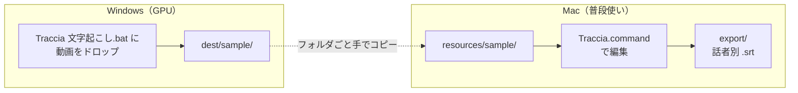

# Traccia — 話者別字幕ツール

動画から文字起こしして話者を分け、その結果を人が直すためのツール。


上がプレビューと再生位置、下が波形と**話者ごとのレーン**、右が字幕リスト。
ブロックを掴んで尺を直し、上下に動かして話者を変え、リストで本文を打ち直す。

名前はイタリア語の *traccia*（なぞった跡 / 音声トラック）から。
音声を文字と時間でなぞってタイムラインに並べる、という中身をそのまま指している。

| サブコマンド | 何をするか | どこで走らせるか |
|---|---|---|
| `transcribe` | 文字起こし + 話者分離（faster-whisper / pyannote）| **GPU のある Windows**。Intel Mac では実用にならない |
| `edit` | 出てきた `.srt` を人が直す（3 ペインのエディタ）| **Mac**。ブラウザで動く |
| `wfp` | Filmora のプロジェクトから、仕上げた字幕を取り戻す | どこでも |

編集側は標準ライブラリだけで動く（動画のメタデータ取得に、すでに入っている PyAV を使う）。
`transcribe` の重い依存（torch / pyannote / faster-whisper）は、そのサブコマンドを
実行したときにだけ読み込むので、エディタの起動は 0.1 秒ほど。

---

## 何ができるか

- **話者ごとのレーン**に字幕を並べたタイムラインで、尺と話者をドラッグで直す
- 波形とプレビューを見ながら、リストで本文を打ち直す
- **同じ話者の中での重なり**や、読み切れない表示速度に注意マークを出す
- 話者ごとに `.srt` を書き出して、Filmora などに渡す
- **元の `.srt` は読むだけで、一切書き換えない**
- 1 本にどれだけ時間がかかったかを記録して、次の見積もりに使う

---

## 全体の流れ



1. **Windows** — 動画を `Traccia 文字起こし.bat` にドラッグ＆ドロップして、GPU で文字起こし
2. できた `dest/<名前>/` フォルダを、Mac の `resources/` に置く（動画も同じフォルダへ）
3. **Mac** — `Traccia.command` をダブルクリックして直す
4. 「書き出し」で話者ごとの `.srt` を出す
5. Filmora で動画と `.srt` を並べて仕上げる。そこで直した最終版は
   `python -m traccia wfp` でプロジェクト（`.wfp`）から取り戻せる

2 の手動コピーは、いずれ Windows 側をワーカーにして Mac から呼べるようにする予定
（[次にやること](docs/internals.md#次にやること)）。

**Windows を経由したくないとき**は、動画だけを `resources/<名前>/` に置いて、エディタの
「文字起こし」で Gemini に書き起こさせる道もある。ただし**有料**（1 時間の動画あたり $2 前後）。
無料で済ませたいなら上の流れのまま、先にローカルで文字起こしする。
→ [エディタから文字起こしする（Gemini・有料）](docs/gemini.md)

### なぜ Mac で文字起こししないのか

Intel Mac（x86_64）には Apple Silicon の Neural Engine も CUDA も無く、Intel Mac 向け
PyTorch は 2.2.2 で打ち切られている。Apple Silicon なら CPU でも実用的な速度で回るので
Mac 単体で完結できる。処理時間の実測は
[文字起こしマニュアル](docs/transcribe.md#処理時間の目安)を参照。

---

## 始める

Python 3.12 が要る（Intel Mac の場合。理由は `requirements.txt` の冒頭）。

```bash
git clone git@github.com:uribow-lab/traccia.git
cd traccia
python3.12 -m venv .venv
.venv/bin/python -m pip install -r requirements.txt
```

素材を置いて、

```
resources/
  princi/
    princi.mp4      動画
    princi.srt      「話者A: 本文」形式の字幕
```

起動する。ブラウザが開く。

```bash
.venv/bin/python -m traccia edit
```

Mac は `Traccia.command`、Windows は `Traccia.bat` のダブルクリックでも同じ。

> **素材は付いてきません。** `resources/` は `.gitignore` で除外してあり、clone しても
> 存在しません。ドキュメントに出てくる `sample` / `princi` / `bluebottle` は、
> 手元の素材に付けた名前の例です。

環境別の手順・API キーの要否は [セットアップと起動](docs/setup.md) にある。
**字幕の編集だけなら、API キーは 1 つも要らない。**

---

## ドキュメント

| | |
|---|---|
| [セットアップと起動](docs/setup.md) | 環境別の入れ方、起動の仕方、コマンドの書き方 |
| [素材と保存先](docs/workflow.md) | 素材の置き方、Traccia が何をどこに書くか、世代バックアップ、作業時間の記録 |
| [エディタの使い方](docs/editor.md) | 画面・マウス・キーボード・字幕の追加と分割・注意マーク・話者の設定 |
| [文字起こし（ローカル・無料）](docs/transcribe.md) | `transcribe` の詳細。環境別セットアップ、全オプション、処理時間、トラブルシューティング |
| [文字起こし（Gemini・有料）](docs/gemini.md) | エディタのボタンから書き起こす。費用と、使いすぎないための仕掛け |
| [Filmora から字幕を取り出す](docs/filmora.md) | `wfp` の詳細。話者の見分け方、字幕トラックの判定 |
| [API キーの取得手順](docs/api-keys.md) | `HF_TOKEN` / `GEMINI_API_KEY` ほかの取り方と、詰まりやすいところ |
| [中身の話](docs/internals.md) | ファイル構成、処理の流れ、なぜそうしたか、これから何をするか |
| [SECURITY.md](SECURITY.md) | キーと素材の扱い、脆弱性の報告先 |
| [CONTRIBUTING.md](CONTRIBUTING.md) | 何を歓迎して、何を受けていないか |

---

## リポジトリに含まれないもの

clone しても以下は付いてきません。**どれも Traccia の動作には不要**です。

| | 何か | なぜ含めないか |
|---|---|---|
| `resources/` | 素材の動画と字幕 | 動画 1 本で 600〜900MB あり、中身も手元のもの。→ [素材の置き方](docs/workflow.md#素材の置き方) |
| `bench/` | 文字起こし API を比較した検証用スクリプト | 実行結果に素材の書き起こしがそのまま残るため。`docs/api-keys.md` に出てくる数字はここで実測したもの |
| `docs-local/` | 手元用のメモ・下書き | 公開するものではない |
| `.env` | Jira / Chatwork 連携の値 | 開発ワークフロー用。キー名の見本は `.env.example` にある |
| `.venv/` | 仮想環境 | `requirements.txt` から作り直せる |

---

## ライセンス

MIT License（[LICENSE](LICENSE)）。

依存パッケージのライセンスは、このリポジトリのライセンスとは別です。
とくに **PyAV は FFmpeg のバイナリを同梱しており、LGPL が絡みます**。
ソースの形で配布・利用するぶんには影響はほぼありませんが、
将来これを 1 つの実行ファイル（`.app` など）にまとめて配る場合は、
そこで改めて確認が要ります。

そのほかの主な依存は MIT / BSD-3 / Apache-2.0 です。
