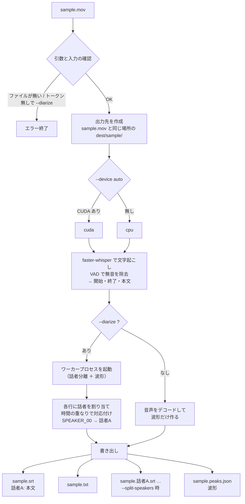
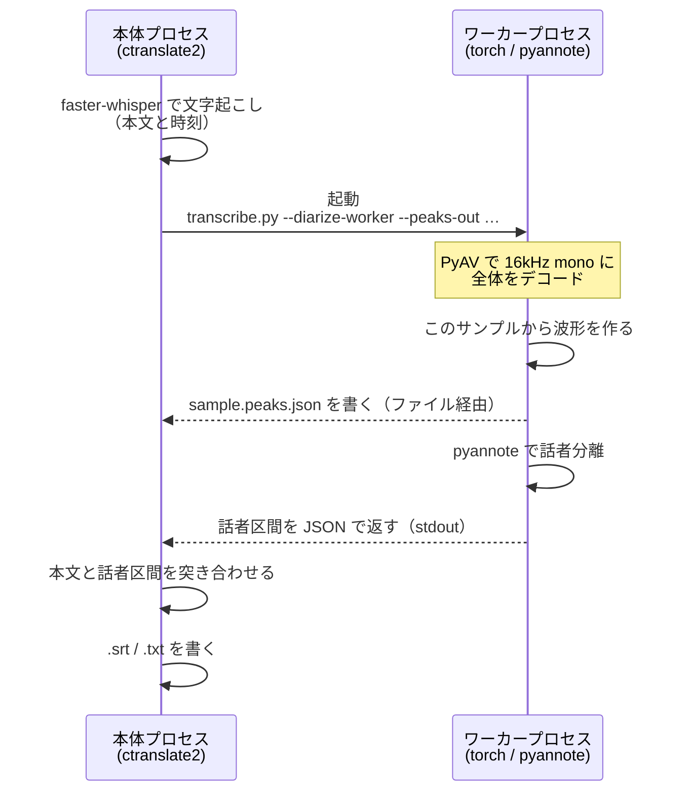

# 中身の話

> [Traccia](../README.md) のドキュメント。ファイルの並び、文字起こしの処理の流れ、
> なぜそうしたか、これから何をするか。使うだけなら読まなくてよい。

---

## ファイル構成

```
traccia/
  README.md                入口。何ができるかと、最初の 1 回
  docs/
    setup.md               入れ方と起動
    workflow.md            素材の置き方・保存先・作業時間の記録
    editor.md              エディタの画面と操作
    transcribe.md          文字起こし（ローカル・無料）の詳細マニュアル
    gemini.md              エディタからの文字起こし（Gemini・有料）
    filmora.md             Filmora のプロジェクトから字幕を取り出す
    api-keys.md            API キーの取得手順
    internals.md           この文書
  LICENSE                  MIT
  SECURITY.md              API キーと素材の扱い・脆弱性の報告先
  CONTRIBUTING.md          何を歓迎して何を受けていないか
  .github/
    ISSUE_TEMPLATE/        バグ報告・質問の雛形
    PULL_REQUEST_TEMPLATE.md
  requirements.txt
  .env.example             Jira / Chatwork 連携の設定の見本（動作には不要）
  .gitignore

  Traccia.command          Mac：ダブルクリックで起動
  Traccia.bat              Windows：同上
  Traccia 文字起こし.bat   Windows：動画をドロップで GPU 文字起こし
  transcribe.py            互換用（旧コマンドがそのまま動く）

  traccia/
    __main__.py            サブコマンド分岐（transcribe / edit / wfp）
    transcribe.py          文字起こし + 話者分離（ローカル・無料）
    gemini.py              Gemini での文字起こし（長尺の分割・費用の実測）
    config.py              API キーと使う / 使わないの保存（~/.traccia/config.json）
    usage.py               費用の記録と集計（~/.traccia/usage.jsonl）
    peaks.py               波形のピーク列
    wfp.py                 Filmora のプロジェクト（.wfp）から字幕を取り出す
    editor/
      cli.py               起動処理
      server.py            ローカル HTTP サーバー（標準ライブラリのみ・Range 対応）
      project.py           セット探索 / 読み込み / 保存 / 書き出し
      jobs.py              時間のかかる処理をバックグラウンドで回す
      worklog.py           編集にかけた時間の記録と集計
      srt.py               SRT の読み書き
      waveform.py          波形の受け口
      static/              index.html / app.css / app.js

  resources/               素材（.gitignore で除外）

~/.traccia/                この PC の設定。リポジトリの外に置く
  config.json              Gemini の API キー・使う / 使わない・モデル・今月の上限（0600）
  usage.jsonl              文字起こし 1 回ぶんの実測トークンと概算額
```

動画は Range リクエストで部分配信するので、880MB の mp4 でも先頭から読まずにシークできる。

---

## 文字起こしの処理の流れ

ここに書くのは **`transcribe` コマンド**（ローカル単体）の流れ。エディタの「文字起こし」から
Gemini とローカル 2 つを回して合成する流れは別で、[Gemini で書き起こす](gemini.md#走る順番)にある。



### プロセスを 2 つに分けている理由



`ctranslate2`（文字起こし）と `torch`（話者分離）が別々の OpenMP ランタイムを抱えていて、
同じプロセスに同居させるとデッドロックする（`OMP Error #15`）ため分けている。

副産物として**波形がほぼタダで手に入る**。話者分離が音声を丸ごとデコードするので、
そのサンプル列からピークを作るだけで済み、動画を読み直す必要がない。
書き出しは話者分離の**前**に行うので、pyannote が失敗しても波形は残る。


---

## 次にやること

### 1. Windows ワーカー

`python -m traccia worker` で GPU 機を待受にし、Mac のエディタから「文字起こし」ボタンで
呼べるようにする。`resources/` を SMB で共有しておけば、880MB の動画を転送せずに
Windows が直接読んで `.srt` をその場に書ける。Windows が落ちていれば Mac ローカル実行に
フォールバック（遅い旨を出した上で）。

### 2. Filmora 14 向けの書き出し

Filmora → Traccia は `python -m traccia wfp` で通った
（[Filmora から字幕を取り出す](filmora.md)）。
残りは逆向き、Traccia → Filmora の受け渡し形式の調査。
`.srt` そのまま / FCPXML / `.wfp` を直接組み立てるのいずれか。

`.wfp` を組み立てる案は、読み側で分かったこと（ZIP の中の `timeline.wesproj`、
テロップは `type 7` クリップ + 別タイムラインの `type 4`、時刻は 100ナノ秒）が
そのまま使える。話者ごとのテロップのプリセットを雛形にして差し込む形になる。
